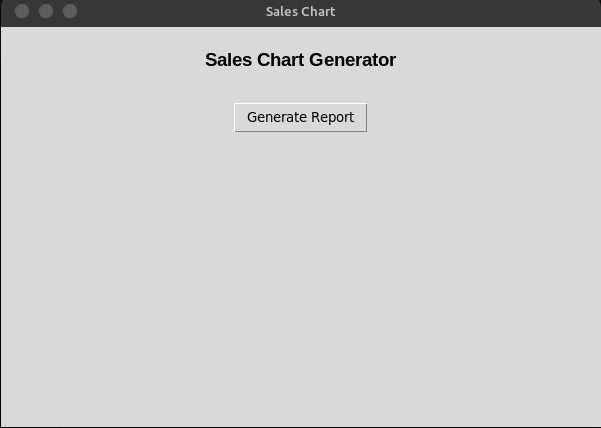
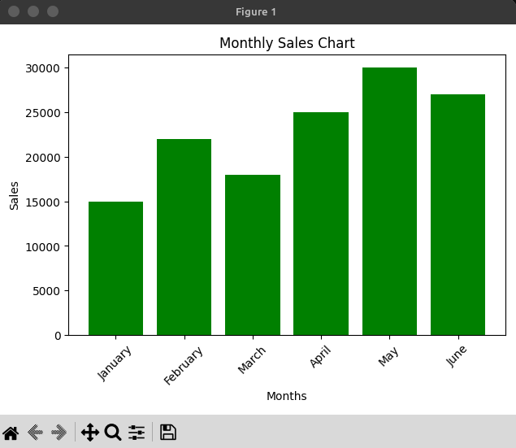

# 📊 Sales Chart Generator

A professional Python desktop tool that reads your sales data from a CSV file and automatically generates a beautiful bar chart — no coding or Python installation required!

Built with **Python**, **Pandas**, **Matplotlib**, and **Tkinter**.

---

## 🖥️ Preview




---

## ✨ Features

- 📂 Browse and select any CSV file from your computer
- 📊 Auto-generates a color-coded bar chart from your sales data
- 💾 Save the chart as a PNG image for reports or presentations
- 🖥️ Simple and clean GUI — no coding required
- ⚡ No Python installation needed — just run the `.exe` file!
- 🔄 Works with any CSV file that has Month and Sales columns

---

## 📋 CSV File Format

Your CSV file **must** have these two columns in this exact order:

```
Month,Sales
January,15000
February,22000
March,18000
April,25000
May,30000
June,27000
```

- First column: **Month** — month names
- Second column: **Sales** — sales numbers

---

## 🚀 How to Use

### Option 1 — Use the .exe file (Recommended)
1. Download `main.exe` from the `dist` folder
2. Double click `main.exe`
3. Click **"Generate Report"**
4. Select your CSV file
5. Your chart will appear instantly! ✅

### Option 2 — Run the Python script
1. Install dependencies:
```bash
pip install pandas matplotlib
```
2. Run the script:
```bash
python main.py
```

---

## 💾 How to Save the Chart

When the chart window opens:
1. Click the **💾 Save icon** in the chart toolbar
2. Choose your desired location
3. Select format — PNG, PDF, SVG, or JPEG
4. Click **Save** ✅

---

## 📁 Project Structure

```
sales-chart-generator/
│
├── dist/
│   └── main.exe          # Standalone executable (no Python needed)
├── main.py               # Python source code
├── sales.csv             # Sample CSV file
├── README.md             # Project documentation
└── screenshots/
    ├── gui.png           # GUI preview
    └── graph.png         # Chart preview
```

---

## 🛠️ Built With

- [Python](https://www.python.org/)
- [Pandas](https://pandas.pydata.org/)
- [Matplotlib](https://matplotlib.org/)
- [Tkinter](https://docs.python.org/3/library/tkinter.html)

---

## 👨‍💻 Author

**Abdullah**
🔗 [GitHub](https://github.com/abdullahautomation)
🌐 [Fiverr](https://www.fiverr.com/abdullah7514)

---

## 📃 License

This project is open source and available under the [MIT License](LICENSE).